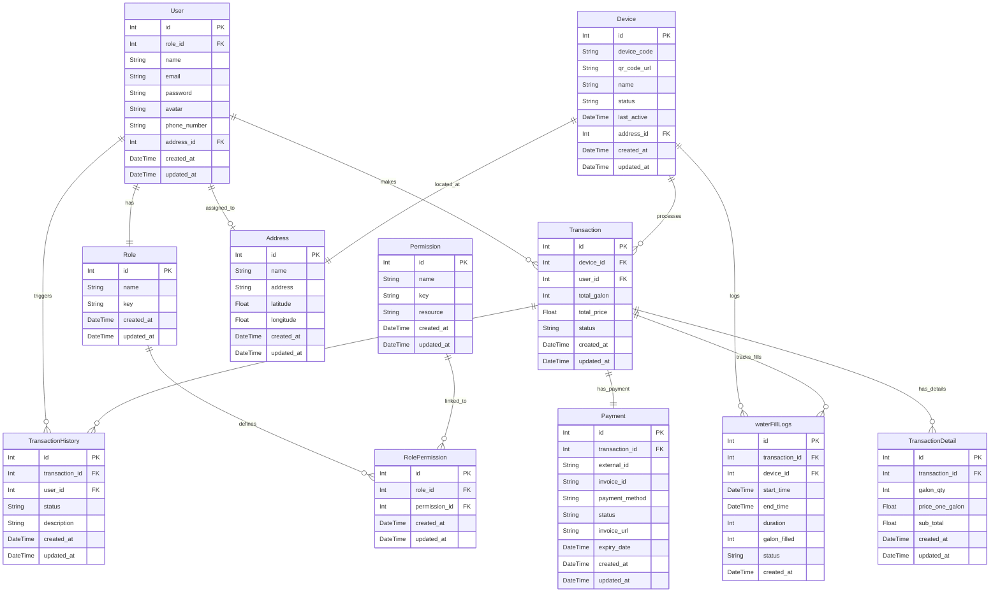

# 🥤 GalonKu Backend API Documentation

Selamat datang di dokumentasi API proyek **GalonKu Backend**. Proyek ini adalah sistem backend berkinerja tinggi yang dibangun menggunakan **NestJS**, **Prisma ORM**, database **PostgreSQL**, dan **Redis** (untuk manajemen antrean Bull MQ). Integrasi pembayaran dilakukan secara mulus menggunakan layanan **Xendit Payment Gateway**.

---

## 🗺️ Daftar Isi
- [⚡ Fitur Utama](#-fitur-utama)
- [🏗️ Arsitektur Database & Hubungan](#️-arsitektur-database--hubungan)
- [🛠️ Persyaratan Lingkungan (Environment Variables)](#️-persyaratan-lingkungan-environment-variables)
- [🧩 Standar Response & Request](#-standar-response--request)
- [📂 API Reference](#-api-reference)
  - [🔐 1. Authentication (`/auth`)](#-1-authentication-auth)
  - [👤 2. Profile Management (`/profile`)](#-2-profile-management-profile)
  - [👥 3. User Management (`/users`)](#-3-user-management-users)
  - [📍 4. Address Management (`/address`)](#-4-address-management-address)
  - [📱 5. Device Management (`/devices`)](#-5-device-management-devices)
  - [💳 6. Transactions & Payments (`/transactions`)](#-6-transactions--payments-transactions)
  - [⚡ 7. Webhooks (`/transactions/webhook`)](#-7-webhooks-transactionswebhook)
  - [🔑 8. Roles & Permissions (`/roles` & `/permissions`)](#-8-roles--permissions-roles--permissions)
- [💻 Cara Menjalankan Project](#-cara-menjalankan-project)

---

## ⚡ Fitur Utama

- **Authentication & Authorization**: Registrasi, login, serta manajemen hak akses berbasis Role-Permission (Super Admin, Operator, dan Customer).
- **Profile Management**: Pembaruan profil user (email, nama, password, nomor telepon) dan dukungan upload avatar (foto profil).
- **User Management**: Manajemen data pengguna terpusat dengan batasan hak akses yang ketat.
- **Device Management**: Registrasi unit dispenser air pintar (GalonKu), generate QR Code otomatis per device, serta scanning berbasis device code.
- **Address Management**: Pemetaan lokasi penempatan dispenser air pintar, lengkap dengan koordinat latitude dan longitude.
- **Transactions & Payments**: Alur pembelian air galon otomatis terintegrasi dengan **Xendit Invoice** dan antrean expiry payment waktu-nyata menggunakan **Bull MQ** (didukung oleh Redis).
- **Dashboard & Analytics**: Menyediakan visualisasi ringkasan kinerja penjualan galon, total pendapatan, jumlah perangkat aktif, serta statistik periodik (harian/bulanan).
- **Xendit Webhook**: Integrasi penanganan callback otomatis untuk sinkronisasi status pembayaran dari Xendit secara real-time.

---

## 🏗️ Arsitektur Database & Hubungan

Berikut adalah visualisasi hubungan antar-tabel dalam database **GalonKu** yang dibangun menggunakan Prisma ORM:



---

## 🛠️ Persyaratan Lingkungan (Environment Variables)

Buat file `.env` di root direktori project dan konfigurasi variabel berikut:

```env
# Database & Server Config
DATABASE_URL="postgresql://<username>:<password>@<host>:<port>/<db_name>?schema=public"
PORT=3000
FRONTEND_URL="http://localhost:5173"

# JWT Authentication
JWT_SECRET_KEY="your_jwt_secret_key"
JWT_EXPIRES_IN="1d"

# Integration API Keys
OPENCAGE_API_KEY="your_opencage_api_key"
XENDIT_SECRET_KEY="your_xendit_secret_key"

# Redis Config (Untuk antrean Bull MQ)
REDIS_HOST="localhost"
REDIS_PORT=6379
```

---

## 🧩 Standar Response & Request

### 1. Snake Case Serialization
Seluruh response API otomatis dikonversi dari format `camelCase` (di dalam kode TypeScript/Database) menjadi `snake_case` sebelum dikirimkan ke client melalui `ResponseInterceptor`. 

### 2. Format Response Sukses (Standard Wrapper)
```json
{
  "message": "Pesan informasi sukses",
  "data": {
    "key_satu": "nilai",
    "key_dua": "nilai"
  }
}
```

### 3. Format Response Error Validasi (Zod)
Validasi request body menggunakan Zod. Jika terjadi kesalahan validasi, server akan mengembalikan HTTP Status `400 Bad Request` dengan format:
```json
{
  "message": "Validation failed",
  "errors": [
    {
      "path": "nama_field",
      "message": "Pesan error detail mengenai field terkait"
    }
  ]
}
```

### 4. Autentikasi
Sebagian besar endpoint dilindungi oleh `JwtAuthGuard`. Untuk mengakses endpoint tersebut, Anda wajib menyertakan token JWT pada header request:
```http
Authorization: Bearer <your_access_token>
```

---

## 📂 API Reference

### 🔐 1. Authentication (`/auth`)

#### Register User
* **Method**: `POST`
* **Path**: `/auth/register`
* **Auth Required**: No
* **Request Body (JSON)**:
  ```json
  {
    "email": "user@example.com",
    "password": "securepassword123",
    "name": "Dandi Kurnia",
    "phone_number": "081234567890" // opsional, minimal 10 karakter
  }
  ```
* **Response (201 Created)**:
  ```json
  {
    "access_token": "eyJhbGciOiJIUzI1NiIsInR5cCI6IkpXVCJ9...",
    "user": {
      "id": 1,
      "email": "user@example.com",
      "name": "Dandi Kurnia",
      "avatar": null,
      "phone_number": "081234567890",
      "role": {
        "id": 3,
        "name": "Customer",
        "key": "customer",
        "permissions": []
      }
    }
  }
  ```

#### Login User
* **Method**: `POST`
* **Path**: `/auth/login`
* **Auth Required**: No
* **Request Body (JSON)**:
  ```json
  {
    "email": "user@example.com",
    "password": "securepassword123"
  }
  ```
* **Response (200 OK)**:
  *(Format response sama dengan endpoint Register)*

---

### 👤 2. Profile Management (`/profile`)

#### Get Current Profile
* **Method**: `GET`
* **Path**: `/profile`
* **Auth Required**: Yes (JWT Bearer)
* **Response (200 OK)**:
  ```json
  {
    "message": "Profile fetched successfully",
    "data": {
      "id": 1,
      "email": "user@example.com",
      "name": "Dandi Kurnia",
      "avatar": "uploads/photos/unique-filename.jpg",
      "phone_number": "081234567890",
      "role": {
        "id": 3,
        "name": "Customer",
        "key": "customer"
      }
    }
  }
  ```

#### Update Profile
* **Method**: `PATCH`
* **Path**: `/profile`
* **Auth Required**: Yes (JWT Bearer)
* **Request Body**: `multipart/form-data`
  * **Fields**:
    * `name` (string, opsional)
    * `email` (string, opsional)
    * `password` (string, opsional, min 8 karakter)
    * `phone_number` (string, opsional, min 10 karakter)
  * **Files**:
    * `avatar` (File gambar format: `jpg`, `jpeg`, `png`, `gif`, `webp`, `avif`, opsional)
* **Response (200 OK)**:
  ```json
  {
    "message": "Profile updated successfully",
    "data": {
      "id": 1,
      "email": "user_baru@example.com",
      "name": "Dandi Kurnia Edit",
      "avatar": "uploads/photos/1716800000000-987654321.png",
      "phone_number": "081299998888",
      "role": {
        "id": 3,
        "name": "Customer",
        "key": "customer"
      }
    }
  }
  ```

---

### 👥 3. User Management (`/users`)

#### List All Users
* **Method**: `GET`
* **Path**: `/users`
* **Auth Required**: Yes (JWT Bearer)
* **Required Permission**: `users.read`
* **Query Params**: `limit` (integer, opsional)
* **Response (200 OK)**:
  ```json
  {
    "message": "Users retrieved successfully",
    "data": [
      {
        "id": 2,
        "role_id": 3,
        "name": "Budi Santoso",
        "email": "budi@example.com",
        "avatar": null,
        "phone_number": "085712345678",
        "address_id": null,
        "created_at": "2026-05-27T10:15:30.000Z",
        "updated_at": "2026-05-27T10:15:30.000Z"
      }
    ]
  }
  ```

#### Create User
* **Method**: `POST`
* **Path**: `/users`
* **Auth Required**: Yes (JWT Bearer)
* **Required Permission**: `users.create`
* **Request Body (JSON)**:
  ```json
  {
    "name": "Ahmad Dani",
    "email": "ahmad.dani@example.com",
    "password": "supersecurepassword123",
    "phone_number": "089876543210",
    "roleId": 3, // ID Peran
    "addressId": 1 // ID Alamat (opsional)
  }
  ```
* **Response (201 Created)**:
  ```json
  {
    "message": "User created successfully",
    "data": {
      "id": 3,
      "role_id": 3,
      "name": "Ahmad Dani",
      "email": "ahmad.dani@example.com",
      "avatar": null,
      "phone_number": "089876543210",
      "address_id": 1,
      "created_at": "2026-05-28T03:00:00.000Z",
      "updated_at": "2026-05-28T03:00:00.000Z"
    }
  }
  ```

#### Update User
* **Method**: `PATCH`
* **Path**: `/users/:id`
* **Auth Required**: Yes (JWT Bearer)
* **Required Permission**: `users.update`
* **Request Body (JSON)**:
  *(Sama seperti request body POST `/users`)*
* **Response (200 OK)**:
  ```json
  {
    "message": "User updated successfully",
    "data": {
      "id": 3,
      "role_id": 3,
      "name": "Ahmad Dani Terupdate",
      "email": "ahmad.dani@example.com",
      "avatar": null,
      "phone_number": "089876543210",
      "address_id": 1,
      "created_at": "2026-05-28T03:00:00.000Z",
      "updated_at": "2026-05-28T03:05:00.000Z"
    }
  }
  ```

---

### 📍 4. Address Management (`/address`)

#### Get All Addresses
* **Method**: `GET`
* **Path**: `/address`
* **Query Params**: `limit` (integer, opsional)
* **Auth Required**: Yes (JWT Bearer)
* **Response (200 OK)**:
  ```json
  {
    "message": "Addresses retrieved successfully",
    "data": [
      {
        "id": 1,
        "name": "Stasiun Pondok Cina",
        "address": "Jl. Pondok Cina, Beji, Depok",
        "latitude": -6.3687,
        "longitude": 106.8324,
        "created_at": "2026-05-27T08:00:00.000Z",
        "updated_at": "2026-05-27T08:00:00.000Z"
      }
    ]
  }
  ```

#### Get Address by ID
* **Method**: `GET`
* **Path**: `/address/:id`
* **Auth Required**: Yes (JWT Bearer)
* **Response (200 OK)**:
  ```json
  {
    "message": "Address retrieved successfully",
    "data": {
      "id": 1,
      "name": "Stasiun Pondok Cina",
      "address": "Jl. Pondok Cina, Beji, Depok",
      "latitude": -6.3687,
      "longitude": 106.8324,
      "created_at": "2026-05-27T08:00:00.000Z",
      "updated_at": "2026-05-27T08:00:00.000Z"
    }
  }
  ```

#### Create Address
* **Method**: `POST`
* **Path**: `/address`
* **Auth Required**: Yes (JWT Bearer)
* **Required Permission**: `addresses.create`
* **Request Body (JSON)**:
  ```json
  {
    "name": "Stasiun Depok Baru",
    "address": "Jl. Margonda Raya, Depok",
    "latitude": -6.3912, // opsional, range: -90 s.d 90
    "longitude": 106.8188 // opsional, range: -180 s.d 180
  }
  ```
* **Response (201 Created)**:
  *(Mengembalikan objek address yang baru dibuat di dalam properti `data`)*

#### Update Address
* **Method**: `PATCH`
* **Path**: `/address/:id`
* **Auth Required**: Yes (JWT Bearer)
* **Required Permission**: `addresses.update`
* **Request Body (JSON)**:
  *(Sama seperti request body POST `/address`)*
* **Response (200 OK)**:
  *(Mengembalikan objek address yang telah diperbarui)*

#### Delete Address
* **Method**: `DELETE`
* **Path**: `/address/:id`
* **Auth Required**: Yes (JWT Bearer)
* **Required Permission**: `addresses.delete`
* **Response (200 OK)**:
  ```json
  {
    "message": "Address removed successfully",
    "data": null
  }
  ```

---

### 📱 5. Device Management (`/devices`)

#### Get All Devices
* **Method**: `GET`
* **Path**: `/devices`
* **Auth Required**: Yes (JWT Bearer)
* **Keterangan**: Super Admin dapat melihat semua device, Operator melihat device di wilayah address-nya, Customer melihat device yang terdaftar.
* **Response (200 OK)**:
  ```json
  {
    "message": "Device retrived successfully",
    "data": [
      {
        "id": 1,
        "device_code": "DEV-1716801234",
        "qr_code_url": "/uploads/qrcodes/DEV-1716801234_1716801234567.png",
        "name": "Dispenser Lantai 1",
        "status": "ACTIVE",
        "last_active": "2026-05-27T08:00:00.000Z",
        "address_id": 1,
        "created_at": "2026-05-27T08:00:00.000Z",
        "updated_at": "2026-05-27T08:00:00.000Z"
      }
    ]
  }
  ```

#### Get Device by ID
* **Method**: `GET`
* **Path**: `/devices/:id`
* **Auth Required**: Yes (JWT Bearer)
* **Response (200 OK)**:
  ```json
  {
    "message": "Device found successfully",
    "data": {
      "id": 1,
      "device_code": "DEV-1716801234",
      "qr_code_url": "/uploads/qrcodes/DEV-1716801234_1716801234567.png",
      "name": "Dispenser Lantai 1",
      "status": "ACTIVE",
      "last_active": "2026-05-27T08:00:00.000Z",
      "address_id": 1,
      "created_at": "2026-05-27T08:00:00.000Z",
      "updated_at": "2026-05-27T08:00:00.000Z"
    }
  }
  ```

#### Create Device
* **Method**: `POST`
* **Path**: `/devices`
* **Auth Required**: Yes (JWT Bearer)
* **Required Permission**: `devices.create`
* **Request Body (JSON)**:
  ```json
  {
    "address_id": 1,
    "name": "Dispenser Lantai 2"
  }
  ```
* **Response (201 Created)**:
  *(Mengembalikan objek device beserta QR Code path yang di-generate otomatis)*

#### Update Device
* **Method**: `PATCH`
* **Path**: `/devices/:id`
* **Auth Required**: Yes (JWT Bearer)
* **Required Permission**: `devices.update`
* **Request Body (JSON)**:
  *(Sama seperti request body POST `/devices`)*

#### Get Device by Code (Scan)
* **Method**: `GET`
* **Path**: `/devices/scan/:code`
* **Auth Required**: Yes (JWT Bearer)
* **Response (200 OK)**:
  *(Mencari device berdasarkan `device_code` unik, sering digunakan saat scan QR Code dari aplikasi mobile)*

#### Delete Device
* **Method**: `DELETE`
* **Path**: `/devices/:id`
* **Auth Required**: Yes (JWT Bearer)

---

### 💳 6. Transactions & Payments (`/transactions`)

#### Create Transaction (Order)
* **Method**: `POST`
* **Path**: `/transactions`
* **Auth Required**: Yes (JWT Bearer)
* **Request Body (JSON)**:
  ```json
  {
    "total_galon": 2, // jumlah galon yang dibeli
    "device_code": "DEV-1716801234" // kode dispenser
  }
  ```
* **Response (201 Created)**:
  * *Catatan*: API akan menghitung harga otomatis (Rp8.000/galon), membuat transaksi, menerbitkan invoice di **Xendit**, lalu mendaftarkan expiry-timer BullMQ.
  ```json
  {
    "message": "Transaction created successfully",
    "data": {
      "id": 12,
      "device_id": 1,
      "user_id": 1,
      "total_galon": 2,
      "total_price": 16000,
      "status": "PENDING",
      "created_at": "2026-05-27T08:15:30.000Z",
      "updated_at": "2026-05-27T08:15:30.000Z",
      "payment": {
        "id": 8,
        "transaction_id": 12,
        "external_id": "INV-1716802530000-12",
        "invoice_id": "6654490f23df65d4b8aa2",
        "payment_method": null,
        "status": "PENDING",
        "invoice_url": "https://checkout.xendit.co/v2/invoice/6654490f23df65d4b8aa2",
        "expiry_date": "2026-05-28T08:15:30.000Z",
        "created_at": "2026-05-27T08:15:30.000Z",
        "updated_at": "2026-05-27T08:15:30.000Z"
      }
    }
  }
  ```

#### Get All Transactions
* **Method**: `GET`
* **Path**: `/transactions`
* **Auth Required**: Yes (JWT Bearer)
* **Hak Akses**:
  - *Super Admin*: Menampilkan seluruh transaksi sistem.
  - *Operator*: Menampilkan transaksi alat dispenser yang berada di bawah pengawasannya (berdasarkan `address_id`).
  - *Customer*: Menampilkan riwayat transaksi pribadinya.

#### Get Transaction by ID
* **Method**: `GET`
* **Path**: `/transactions/:id`
* **Auth Required**: Yes (JWT Bearer)
* **Response (200 OK)**:
  * Mengembalikan data lengkap transaksi termasuk log pengisian air (`water_fill_logs`), riwayat transaksi (`transaction_histories`), rincian pembayaran, serta data user/device terkait.

#### Get Dashboard Summary
* **Method**: `GET`
* **Path**: `/transactions/summary`
* **Auth Required**: Yes (JWT Bearer)
* **Query Params**:
  * `addressId` (number, opsional - digunakan oleh Super Admin untuk memfilter ringkasan wilayah tertentu)
* **Response (200 OK)**:
  ```json
  {
    "message": "Dashboard summary retrieved successfully",
    "data": {
      "totalDevices": 4,
      "totalTransactions": 28,
      "totalGalons": 56,
      "totalRevenue": 448000
    }
  }
  ```

#### Get Transaction Statistics
* **Method**: `GET`
* **Path**: `/transactions/stats`
* **Auth Required**: Yes (JWT Bearer)
* **Query Params**:
  * `groupBy` (string, opsional, pilihan: `daily` atau `monthly`, default: `daily`)
  * `addressId` (number, opsional)
  * `startDate` (string/ISO-date, opsional)
  * `endDate` (string/ISO-date, opsional)
* **Response (200 OK)**:
  ```json
  {
    "message": "Transaction statistics retrieved successfully",
    "data": [
      {
        "date": "2026-05-27",
        "totalGalon": 12,
        "totalPrice": 96000
      },
      {
        "date": "2026-05-28",
        "totalGalon": 8,
        "totalPrice": 64000
      }
    ]
  }
  ```

---

### ⚡ 7. Webhooks (`/transactions/webhook`)

#### Xendit Payment Webhook
* **Method**: `POST`
* **Path**: `/transactions/webhook/xendit`
* **Auth Required**: No (Diakses otomatis oleh callback Xendit)
* **Request Body (JSON)**:
  ```json
  {
    "id": "6654490f23df65d4b8aa2",
    "external_id": "INV-1716802530000-12",
    "status": "PAID",
    "amount": 16000,
    "payment_method": "OVO",
    "paid_amount": 16000,
    "paid_at": "2026-05-27T08:16:00.000Z",
    "payer_email": "user@example.com"
  }
  ```
* **Response (200 OK)**:
  ```json
  {
    "message": "Webhook received successfully"
  }
  ```

---

### 🔑 8. Roles & Permissions (`/roles` & `/permissions`)

#### List All Roles
* **Method**: `GET`
* **Path**: `/roles`
* **Auth Required**: Yes (JWT Bearer)
* **Required Permission**: `roles.read`
* **Response (200 OK)**:
  ```json
  {
    "message": "Roles fetched successfully",
    "data": [
      {
        "id": 1,
        "name": "Super Admin",
        "key": "super-admin"
      },
      {
        "id": 2,
        "name": "Operator",
        "key": "operator"
      },
      {
        "id": 3,
        "name": "Customer",
        "key": "customer"
      }
    ]
  }
  ```

#### Get Role by ID
* **Method**: `GET`
* **Path**: `/roles/:id`
* **Auth Required**: Yes (JWT Bearer)
* **Response (200 OK)**:
  ```json
  {
    "message": "Role fetched by id 2 successfully",
    "data": {
      "id": 2,
      "name": "Operator",
      "key": "operator",
      "permissions": [
        {
          "id": 1,
          "name": "Read Devices",
          "key": "devices.read"
        }
      ]
    }
  }
  ```

#### Update Role Permissions
* **Method**: `PATCH`
* **Path**: `/roles/:id`
* **Auth Required**: Yes (JWT Bearer)
* **Request Body (JSON)**:
  ```json
  {
    "permission_ids": [1, 2, 3] // array dari integer, tidak boleh kosong
  }
  ```
* **Response (200 OK)**:
  ```json
  {
    "message": "Role updated by id 2 successfully",
    "data": {
      "id": 2,
      "name": "Operator",
      "key": "operator"
    }
  }
  ```

#### List All Permissions
* **Method**: `GET`
* **Path**: `/permissions`
* **Auth Required**: Yes (JWT Bearer)
* **Response (200 OK)**:
  ```json
  {
    "message": "Permission fetched successfully",
    "data": [
      {
        "id": 1,
        "name": "Create Device",
        "key": "devices.create",
        "resource": "devices"
      },
      {
        "id": 2,
        "name": "Read Device",
        "key": "devices.read",
        "resource": "devices"
      }
    ]
  }
  ```

---

## 💻 Cara Menjalankan Project

### 📥 1. Install Dependencies
```bash
npm install
```

### 🗃️ 2. Jalankan PostgreSQL dan Redis
Pastikan PostgreSQL dan Redis server sudah berjalan di sistem Anda sesuai dengan parameter di `.env`.

### 🔄 3. Jalankan Prisma Migration & Seeders
Jalankan migrasi database PostgreSQL untuk menyusun tabel-tabel baru:
```bash
npx prisma migrate dev
```

*(Opsional)* Jalankan seeder database jika tersedia untuk mengisi data peran default:
```bash
npx prisma db seed
```

### 🚀 4. Jalankan Aplikasi

```bash
# Mode Development
npm run start

# Mode Watch (Auto Reload & Rekomendasi Dev)
npm run start:dev

# Mode Production
npm run start:prod
```

### 🧪 5. Uji Coba Unit Test & E2E
```bash
# Menjalankan unit test
npm run test

# Menjalankan End-to-End test
npm run test:e2e
```
